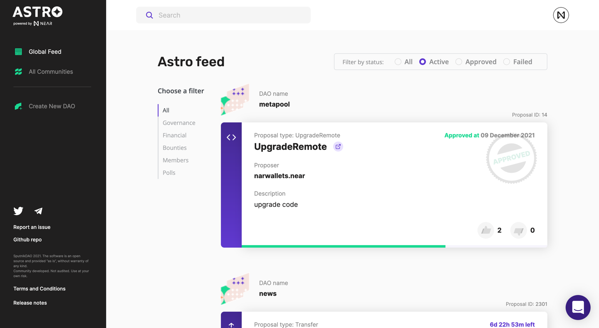

# Astro DAO

Astro is a platform for launching Decentralized Autonomous Organizations. DAOs are self-organized groups that form around common purposes. Membership, decision making, and funding are coordinated in public on a tamper-proof blockchain.

#### Technology stack

- Blockchain
- Smart Contracts
- Astro backend
- Astro landing page
- Package manager
- Core programming language: **[TypeScript](https://www.typescriptlang.org/)**
- Application framework: **[NextJS](https://nextjs.org/)**
- Code quality: **[Eslint](https://eslint.org/), [Prettier](https://prettier.io/)**
- Build: **[Docker](https://www.docker.com/)**

#### Status

[Change Log](https://github.com/near-daos/astro-ui/releases/latest)



###### Install dependencies

```bash
yarn install
```

###### Run development server

```bash
yarn dev
```

Open [http://localhost:8080](http://localhost:8080) with your browser to see the result.

##### Known issues

The application can fail loading icons when running locally, in this case just build an application locally before starting development server using this command:

```
yarn build
```
